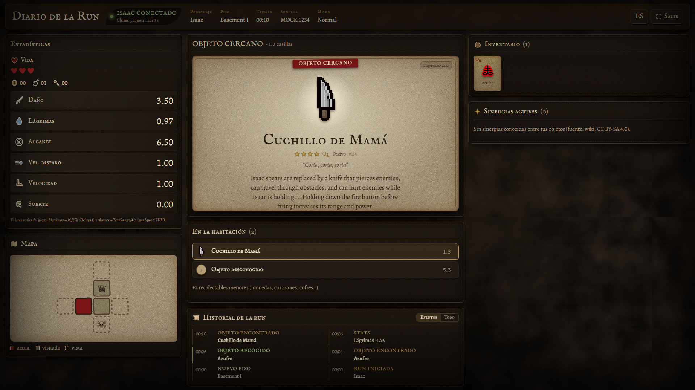
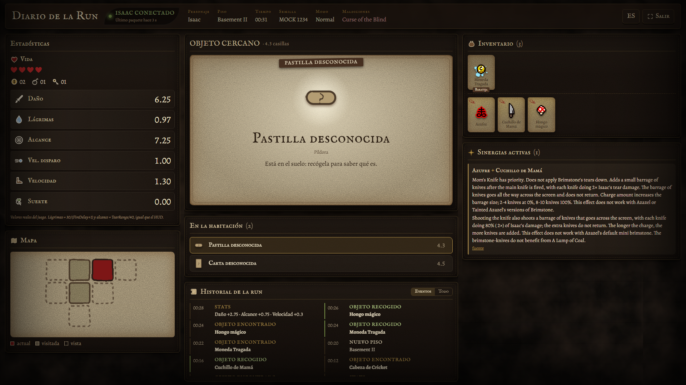
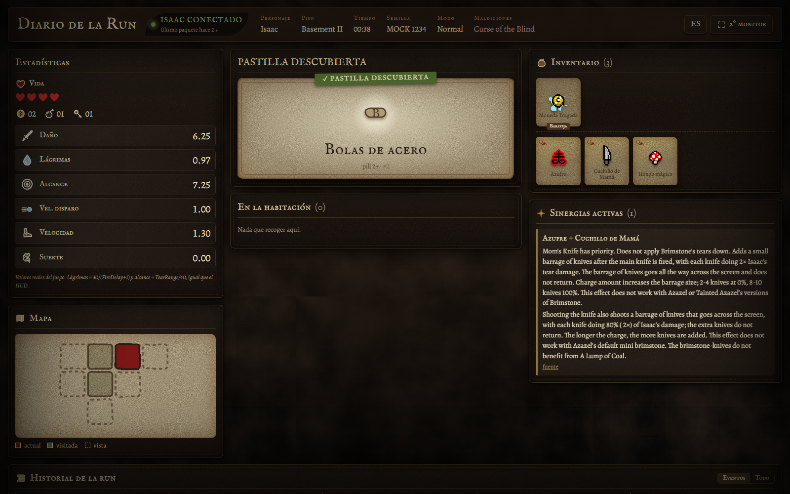
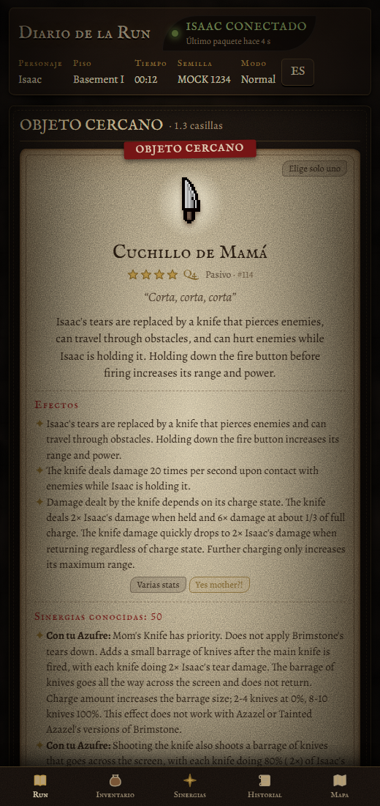

<p align="center">
  
</p>

<p align="center">
  <a href="https://galfar10.github.io/Isaac-Chronicle/"><b>🌐 Web</b></a> ·
  <a href="https://github.com/Galfar10/Isaac-Chronicle/releases/latest"><b>⬇️ Descargar Companion</b></a> ·
  <a href="https://steamcommunity.com/sharedfiles/filedetails/?id=3812867579"><b>🎮 Mod en Steam Workshop</b></a> ·
  <a href="INSTALL.md">Instalación</a> ·
  <a href="ARCHITECTURE.md">Arquitectura</a>
</p>

<p align="center">
  <a href="https://github.com/Galfar10/Isaac-Chronicle/actions/workflows/ci.yml"></a>
  <a href="https://github.com/Galfar10/Isaac-Chronicle/actions/workflows/pages.yml"></a>
  
  
</p>

# Isaac Chronicle

**El diario de tu partida de The Binding of Isaac: Repentance+, en tiempo real, en tu segundo monitor o en el móvil.**

Isaac Chronicle es un mod de Steam Workshop + una pequeña app local. El mod **no dibuja nada dentro del juego**: lee los datos de
tu partida y una web los muestra al momento — estadísticas reales, objetos al acercarte, inventario, sinergias, mapa e historial.

> *Descubrimiento, no radar.* No es un EID: los pedestales solo se identifican cuando te acercas, las cartas cuando las recoges
> y las pastillas cuando las tomas. Respeta Curse of the Blind, Curse of the Lost, Curse of the Unknown y Amnesia.

| Segundo monitor | Lo desconocido sigue desconocido |
|---|---|
|  |  |
| **Descubrimientos e historial** | **Móvil** |
|  |  |

## Qué hace

- **Estadísticas reales del juego** (daño, lágrimas, alcance, vel. de disparo, velocidad, suerte, vida, monedas, bombas, llaves,
  transformaciones), actualizadas en ~100 ms y con animación de cambio (`+1.69`).
- **Objeto cercano**: ficha tipo carta con imagen, calidad, frase, descripción, efectos y sinergias con tu inventario. Solo
  cuando te acercas al pedestal; al alejarte vuelve a ocultarse.
- **Cartas** reveladas al recogerlas; **pastillas** al tomarlas (como en el juego). Lo descubierto se guarda en tu perfil local.
- **Inventario** visual, **sinergias activas** entre tus objetos (fuente verificable: Binding of Isaac Wiki), **mapa** en
  pergamino (solo lo que el minimapa muestra) e **historial** de la run.
- **Modo segundo monitor** (todo en una pantalla 1080p) y **móvil**.
- Funciona sin internet: el Companion incluye la web, la base de datos (1.056 objetos, 3.070 sinergias) y lee los sprites y
  los nombres en español de **tu propia copia** del juego.

## Cómo empezar (jugadores)

1. Suscríbete al mod [**Isaac Chronicle** en Steam Workshop](https://steamcommunity.com/sharedfiles/filedetails/?id=3812867579).
2. Descarga [`IsaacCompanion-win-x64.zip`](https://github.com/Galfar10/Isaac-Chronicle/releases/latest), descomprímelo y
   ejecuta `IsaacCompanion.exe`. Déjalo abierto mientras juegas.
3. Abre <http://127.0.0.1:47823> (se abre solo) o <https://galfar10.github.io/Isaac-Chronicle/>.
4. Juega. La web muestra 🟢 **ISAAC CONECTADO**.

No necesitas Node.js, Python, Docker ni la opción `--luadebug`. Detalles y solución de problemas en [INSTALL.md](INSTALL.md).

## Cómo funciona

```
Isaac ──(mod Lua · Isaac.DebugString)──▶ log.txt ──▶ Isaac Companion (.exe · 127.0.0.1) ──WebSocket──▶ navegador
```

Los mods de Isaac no pueden usar la red ni lanzar programas (salvo con `--luadebug`, que es inseguro), así que el mod escribe
mensajes compactos en el `log.txt` del juego y el Companion los lee, mantiene el estado y lo sirve por WebSocket. La web
publicada en GitHub Pages se conecta a ese Companion local: **tus datos no salen de tu PC**.
Arquitectura, protocolo, API y limitaciones: [ARCHITECTURE.md](ARCHITECTURE.md).

## Desarrollo

```bash
npm install
```

```bash
npm run mock
```

```bash
npm test
```

`npm run mock` reproduce una partida simulada (mismo formato que el mod) sin abrir Isaac. Más en [DEVELOPMENT.md](DEVELOPMENT.md).

```
isaac-mod/   Mod de Steam Workshop (Lua)      bridge/     Lectura de log.txt y estado de la partida
protocol/    Tipos y protocolo compartidos    backend/    API REST + WebSocket + SQLite
companion/   Ejecutable que lo une todo       web/        React + TypeScript + Vite
database/    Migraciones, datos e importadores tests/      Vitest (incluye el mod Lua en una VM Lua 5.3)
```

## Privacidad

Todo funciona en local (`127.0.0.1`). No se guarda tu nombre ni tu Steam ID; cada run usa un identificador aleatorio.

## Créditos y licencias

- Código: [MIT](LICENSE).
- Textos de objetos, efectos y sinergias: [Binding of Isaac Wiki](https://bindingofisaacrebirth.wiki.gg) — **CC BY-SA 4.0**
  (`database/seed/wiki.json` conserva esa licencia y la URL de cada entrada).
- Nombres en español, calidades y sprites se leen en local de los archivos del juego del usuario; no se redistribuyen.
- The Binding of Isaac es de Edmund McMillen y Nicalis. Proyecto de fans sin afiliación. La interfaz y los iconos son originales.
