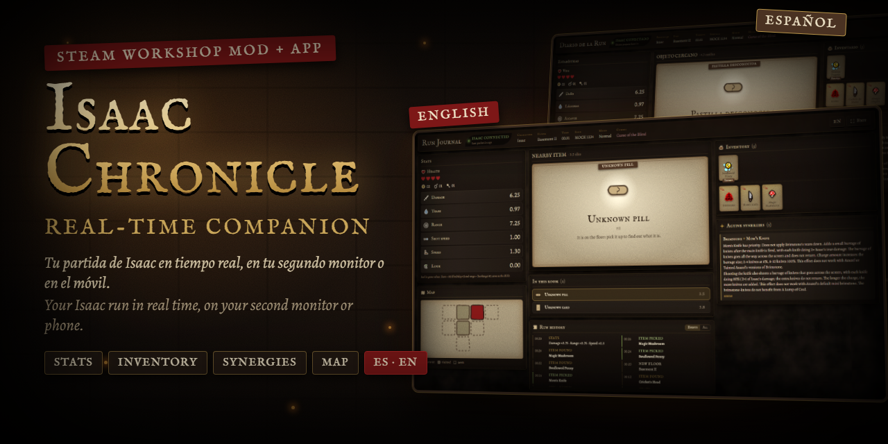
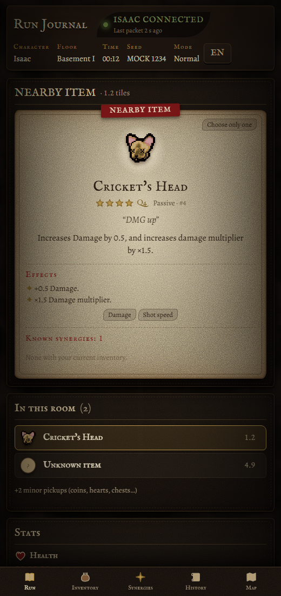

<p align="center">
  
</p>

<p align="center">
  <a href="https://galfar10.github.io/Isaac-Chronicle/"><b>🌐 Web</b></a> ·
  <a href="https://github.com/Galfar10/Isaac-Chronicle/releases/latest"><b>⬇️ Companion (Windows · Steam Deck · macOS)</b></a> ·
  <a href="https://steamcommunity.com/sharedfiles/filedetails/?id=3812867579"><b>🎮 Steam Workshop</b></a> ·
  <a href="https://ko-fi.com/isaacchronicle"><b>☕ Ko-fi</b></a> ·
  <a href="#español">Español</a> ·
  <a href="#english">English</a>
</p>

<p align="center">
  <a href="https://github.com/Galfar10/Isaac-Chronicle/actions/workflows/ci.yml"></a>
  <a href="https://github.com/Galfar10/Isaac-Chronicle/actions/workflows/pages.yml"></a>
  
  
  
</p>

| Español | English |
|---|---|
|  |  |
|  |  |
|  |  |

---

## Español

**Isaac Chronicle** es el diario de tu partida de *The Binding of Isaac: Repentance+*, en tiempo real, en tu segundo monitor
o en el móvil. Es un mod de Steam Workshop + una pequeña app local. **El mod no dibuja nada dentro del juego**: lee los datos
de tu partida y una web los muestra al momento.

> **Descubrimiento, no radar.** No es un EID: los pedestales solo se identifican cuando te acercas, las cartas cuando las
> recoges y las pastillas cuando las tomas. Respeta Curse of the Blind, Curse of the Lost, Curse of the Unknown y Amnesia.

### Qué hace

- **Estadísticas reales del juego** (daño, lágrimas, alcance, vel. de disparo, velocidad, suerte, vida, monedas, bombas,
  llaves, transformaciones), actualizadas en ~100 ms y con animación de cambio (`+1.69`).
- **Objeto cercano**: ficha con imagen, calidad, frase, descripción, efectos y sinergias con tu inventario, solo al acercarte.
- **Cartas** reveladas al recogerlas; **pastillas** al tomarlas (como en el juego). Lo descubierto se guarda en tu perfil.
- **Inventario**, **sinergias activas** (fuente verificable: Binding of Isaac Wiki), **mapa** (solo lo que muestra el
  minimapa) e **historial** de la run.
- **Modo segundo monitor** (todo en una pantalla 1080p) y **móvil**.
- 🌐 **Castellano e inglés**: el botón **ES/EN** cambia toda la interfaz y los nombres y frases de los objetos (tomados del
  propio juego). Las descripciones largas y las sinergias vienen de la wiki y están en inglés.

### Cómo empezar

1. Suscríbete al mod [**Isaac Chronicle** en Steam Workshop](https://steamcommunity.com/sharedfiles/filedetails/?id=3812867579).
2. Descarga el [Companion](https://github.com/Galfar10/Isaac-Chronicle/releases/latest) para tu sistema, descomprímelo y
   ábrelo. Déjalo abierto mientras juegas.
   - **Windows**: `IsaacCompanion-win-x64.zip` → `IsaacCompanion.exe`.
   - **Steam Deck / Linux**: `IsaacCompanion-linux-x64.tar.gz` → en los parámetros de lanzamiento de Isaac en Steam pon
     `"/home/deck/IsaacCompanion/steam-launch.sh" %command%` y arrancará y se cerrará con el juego.
   - **macOS** (Isaac con CrossOver, Whisky o Wine): `IsaacCompanion-macos-arm64.zip` (Apple Silicon) o
     `IsaacCompanion-macos-x64.zip` (Intel) → `isaac-companion`.
3. Se abre <http://127.0.0.1:47823> (o usa <https://galfar10.github.io/Isaac-Chronicle/>).
4. Juega: la web muestra 🟢 **ISAAC CONECTADO**.
5. 📱 **En el móvil**: en la web del PC pulsa **Móvil → Activar modo móvil** y escanea el QR (misma red Wi-Fi).

No necesitas Node.js, Python, Docker ni `--luadebug`. Pasos para cada sistema en [INSTALL.md](INSTALL.md).

---

## English

**Isaac Chronicle** is a real-time journal of your *The Binding of Isaac: Repentance+* run, on your second monitor or your
phone. It is a Steam Workshop mod + a small local app. **The mod draws nothing in-game**: it reads your run data and a web
page shows it instantly.

> **Discovery, not a radar.** It is not an EID: pedestal items are only identified when you get close, cards when you pick
> them up and pills when you take them. Curse of the Blind, Curse of the Lost, Curse of the Unknown and Amnesia are respected.

### Features

- **Real in-game stats** (damage, tears, range, shot speed, speed, luck, health, coins, bombs, keys, transformations),
  updated in ~100 ms with change animations (`+1.69`).
- **Nearby item** card: sprite, quality, quote, description, effects and synergies with your inventory — only up close.
- **Cards** revealed when picked up; **pills** when taken (like the game). Discoveries are saved in your local profile.
- **Inventory**, **active synergies** (verifiable source: Binding of Isaac Wiki), **map** (only what the minimap shows) and
  **run history**.
- **Second-monitor mode** (everything on one 1080p screen) and **mobile** layout.
- 🌐 **English and Spanish**: the **ES/EN** button switches the whole interface plus item names and quotes (taken from the
  game itself). Long descriptions and synergies come from the wiki and are in English.

### Getting started

1. Subscribe to [**Isaac Chronicle** on Steam Workshop](https://steamcommunity.com/sharedfiles/filedetails/?id=3812867579).
2. Download the [Companion](https://github.com/Galfar10/Isaac-Chronicle/releases/latest) for your system, unzip it and
   run it. Keep it open while you play.
   - **Windows**: `IsaacCompanion-win-x64.zip` → `IsaacCompanion.exe`.
   - **Steam Deck / Linux**: `IsaacCompanion-linux-x64.tar.gz` → set Isaac's Steam launch options to
     `"/home/deck/IsaacCompanion/steam-launch.sh" %command%` and it starts and stops with the game.
   - **macOS** (Isaac through CrossOver, Whisky or Wine): `IsaacCompanion-macos-arm64.zip` (Apple Silicon) or
     `IsaacCompanion-macos-x64.zip` (Intel) → `isaac-companion`.
3. <http://127.0.0.1:47823> opens automatically (or use <https://galfar10.github.io/Isaac-Chronicle/>).
4. Play: the page shows 🟢 **ISAAC CONNECTED**.
5. 📱 **On your phone**: on the PC page press **Mobile → Turn on mobile mode** and scan the QR code (same Wi-Fi).

No Node.js, Python, Docker or `--luadebug` needed. Windows may show "Windows protected your PC" because the executable is not
signed: **More info → Run anyway**. Steam Deck and macOS steps are in [INSTALL.md](INSTALL.md).

---

## Cómo funciona · How it works

```
Isaac ──(Lua mod · Isaac.DebugString)──▶ log.txt ──▶ Isaac Companion (app · 127.0.0.1) ──WebSocket──▶ browser
```

ES: Los mods de Isaac no pueden usar la red ni lanzar programas (salvo con `--luadebug`, inseguro); el mod escribe en el
`log.txt` del juego y el Companion lo lee y lo sirve por WebSocket. **Tus datos no salen de tu PC.**

EN: Isaac mods cannot use the network or start programs (except with the unsafe `--luadebug`); the mod writes to the game's
`log.txt` and the Companion reads it and serves it over WebSocket. **Your data never leaves your PC.**

Architecture, protocol, API and limitations: [ARCHITECTURE.md](ARCHITECTURE.md) · Install/troubleshooting:
[INSTALL.md](INSTALL.md) · Workshop: [WORKSHOP.md](WORKSHOP.md) · Development: [DEVELOPMENT.md](DEVELOPMENT.md)

## Desarrollo · Development

```bash
npm install
```

```bash
npm run mock
```

```bash
npm test
```

`npm run mock` plays a simulated run (same format as the mod) without opening Isaac.

```
isaac-mod/   Steam Workshop mod (Lua)          bridge/     log.txt reader and game state
protocol/    Shared types and protocol         backend/    REST API + WebSocket + SQLite
companion/   Single executable                 web/        React + TypeScript + Vite (ES/EN)
database/    Migrations, data, importers       tests/      Vitest (runs the Lua mod in a Lua 5.3 VM)
```

## Apoyar el proyecto · Support

ES: Isaac Chronicle es gratis y de código abierto. Si te resulta útil, puedes apoyarlo (opcional):
EN: Isaac Chronicle is free and open source. If you find it useful, you can support it (optional):

<a href="https://ko-fi.com/isaacchronicle"></a>
<a href="https://github.com/sponsors/Galfar10"></a>

## Privacidad · Privacy

ES: Todo funciona en local (`127.0.0.1`). No se guarda tu nombre ni tu Steam ID; cada run usa un identificador aleatorio.
EN: Everything runs locally (`127.0.0.1`). Your name and Steam ID are never stored; every run uses a random id.

## Créditos y licencias · Credits and licenses

- Code: [MIT](LICENSE).
- Item, effect and synergy texts: [Binding of Isaac Wiki](https://bindingofisaacrebirth.wiki.gg) — **CC BY-SA 4.0**
  (`database/seed/wiki.json` keeps that license and the source URL of every entry).
- Spanish names, qualities and sprites are read locally from the user's own game files; they are not redistributed.
- The Binding of Isaac © Edmund McMillen / Nicalis. Fan project, not affiliated. The UI and icons are original.
